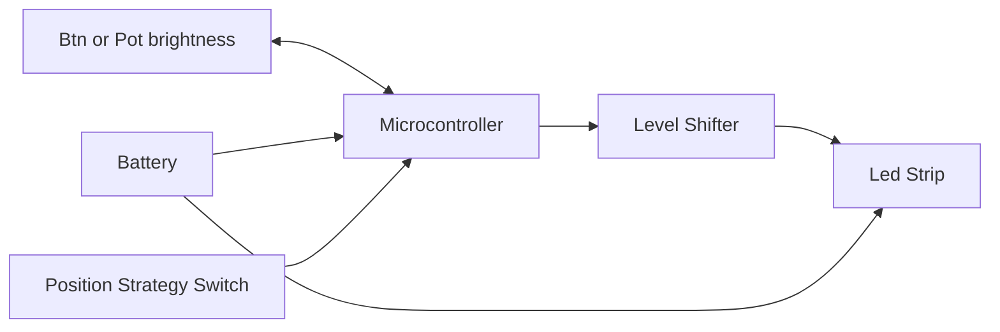

```mermaid
flowchart LR
	micro[Microcontroller] --> lvl[Level Shifter]
	adj[Btn or Pot brightness] <--> micro
	lvl --> led[Led Strip]
	bat[Battery] --> led
	bat --> micro
	pos[Position Strategy Switch] --> micro
```

# Tasks
- scan for devices
- check for inputs
- update lights